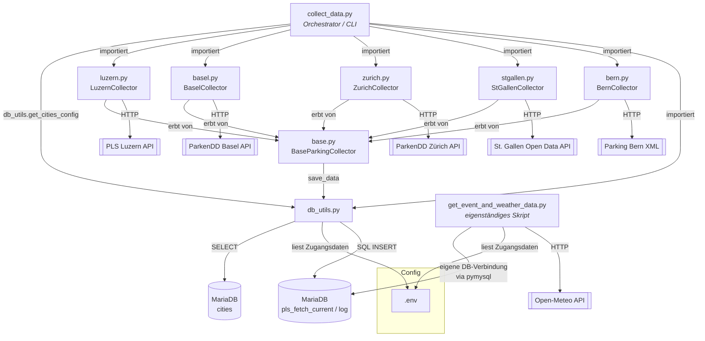

# data-crawler

Sammelt Echtzeit-Parkplatzdaten (PLS – Parkleitsystem) von fünf Schweizer Städten (Luzern, Basel, St. Gallen, Zürich, Bern) und speichert sie als JSON-Historie und in einer MariaDB-Datenbank. Ergänzend gibt es ein Skript zum Nachladen von historischen Wetter- und Event-Daten.

> Diese Doku beschreibt ausschliesslich die Dateien im Root-Ordner `data-crawler/` (keine Unterordner wie `data/`, `config/`, `__pycache__/`).

## Inhaltsverzeichnis

| Datei | Typ | Zweck |
|---|---|---|
| [`base.py`](base.py) | Python | Abstrakte Basisklasse `BaseParkingCollector` (fetch → normalize → save) |
| [`luzern.py`](luzern.py) | Python | Collector für Luzern (eigene PLS-API) |
| [`basel.py`](basel.py) | Python | Collector für Basel (ParkenDD-API) |
| [`zurich.py`](zurich.py) | Python | Collector für Zürich (ParkenDD-API) |
| [`stgallen.py`](stgallen.py) | Python | Collector für St. Gallen (Open-Data-API) |
| [`bern.py`](bern.py) | Python | Collector für Bern (XML-API) |
| [`collect_data.py`](collect_data.py) | Python | Orchestrator/CLI – ruft alle City-Collectoren auf, loggt Ergebnis in DB |
| [`db_utils.py`](db_utils.py) | Python | DB-Hilfsfunktionen (`get_connection`, `insert_measurement`, `insert_log`, `get_cities_config`) |
| [`get_event_and_weather_data.py`](get_event_and_weather_data.py) | Python | Eigenständiges Skript: lädt historisches Wetter (Open-Meteo) und generiert Event-Daten |
| [`database-setup.sql`](database-setup.sql) | SQL | Schema + Stammdaten (Städte, Parkhäuser) |
| [`requirements.txt`](requirements.txt) | Config | Python-Abhängigkeiten |
| [`.env`](.env) | Config | DB-Zugangsdaten (**nicht** versioniert – über `.gitignore` ausgeschlossen, enthält Secrets) |
| [`.gitignore`](.gitignore) | Config | Schliesst `.env` und `__pycache__/` von Git aus |
| `data/` | Ordner | Abgelegte JSON-Snapshots pro Stadt (Unterordner, nicht Teil dieser Doku) |
| `__pycache__/` | Ordner | Python-Bytecode-Cache (generiert, nicht mehr versioniert) |

## Architekturüberblick



## Ablauf pro Collector (`collect()` in `base.py`)

```mermaid
sequenceDiagram
    participant CLI as collect_data.py
    participant C as *Collector (z.B. BaselCollector)
    participant Base as BaseParkingCollector
    participant API as Stadt-API
    participant FS as data/&lt;stadt&gt;/*.json
    participant DB as MariaDB

    CLI->>C: create_collector() + collect()
    C->>Base: fetch_raw_data()
    Base->>API: HTTP GET
    API-->>Base: Rohdaten (JSON/XML)
    Base-->>C: raw_data
    C->>C: normalize_data(raw_data)
    C-->>Base: normalisierte Daten (einheitliches Format)
    Base->>FS: save_data() – JSON-Snapshot schreiben
    Base->>DB: insert_measurement() je Parkplatz
    Base-->>CLI: Statistik (inserted/duplicates/failed)
    CLI->>DB: insert_log() Ergebnis pro Stadt
```

## Modul-Details

### `base.py`
Definiert die abstrakte Klasse **`BaseParkingCollector`**, von der alle Stadt-Collectoren erben:
- `_request_with_retry()` – HTTP-GET mit Timeout (Default 20s) und bis zu `max_retries` Versuchen (Default 3) mit exponentiellem Backoff (`retry_backoff * 2^n`, Default 2s/4s/…). Wird von `fetch_raw_data()` sowie von `bern.py`s Override genutzt.
- `fetch_raw_data()` – generischer HTTP-GET (JSON) über `_request_with_retry()`, von `bern.py` überschrieben (liefert rohe XML-Bytes).
- `normalize_data(raw_data)` – **abstract**, muss von jeder Unterklasse implementiert werden; wandelt API-spezifisches Format in ein einheitliches Schema um (`{status, city, data: {parkings: {...}}, timestamp}`).
- `_load_last_snapshot()` – lädt den zuletzt gespeicherten JSON-Snapshot aus `data/<city_id>/`, als Fallback-Quelle.
- `save_data(data)` – schreibt JSON-Snapshot nach `data/<city_id>/<timestamp>.json` und inserted die Messwerte in die MariaDB-Tabelle `pls_fetch_current` (via `db_utils`).
- `collect()` – High-Level-Methode: fetch → normalize → save. Schlagen Fetch/Normalize nach allen Retries fehl, wird auf `_load_last_snapshot()` zurückgefallen (Status `"fallback"`, Timestamp = jetzt) statt die Stadt für den Lauf komplett ausfallen zu lassen; nur wenn auch kein Snapshot existiert, gilt der Lauf als fehlgeschlagen.

`timeout`, `max_retries` und `retry_backoff` sind über den Konstruktor pro Collector konfigurierbar (aktuell für alle Städte identisch, da `collect_data.py` sie ohne Override instanziiert).

### Stadt-Collectoren (erben von `base.BaseParkingCollector`)
| Datei | Klasse | Quellformat |
|---|---|---|
| `luzern.py` | `LuzernCollector` | Eigenes JSON (bereits gut strukturiert) |
| `basel.py` | `BaselCollector` | ParkenDD-JSON (`lots[]`) |
| `zurich.py` | `ZurichCollector` | ParkenDD-JSON (`lots[]`, gleiches Format wie Basel) |
| `stgallen.py` | `StGallenCollector` | Open-Data-JSON (`records[].fields`) |
| `bern.py` | `BernCollector` | XML (`<parkdata><parking .../></parkdata>`), überschreibt zusätzlich `fetch_raw_data()` |

Jede Klasse implementiert nur `normalize_data()` (Bern zusätzlich `fetch_raw_data()`), der Rest kommt aus `base.py`.

### `collect_data.py`
CLI-Einstiegspunkt (`python collect_data.py [--data-dir DATA]`):
1. Lädt die Städte-Konfiguration aus der DB-Tabelle `cities` (`db_utils.get_cities_config()`).
2. Erstellt für jede Stadt via `COLLECTOR_MAP` die passende Collector-Instanz (`create_collector`), basierend auf der Spalte `collector` (z.B. `basel.BaselCollector`).
3. Ruft `collect()` für jede Stadt auf (`collect_all_cities` → `collect_city_data`).
4. Schreibt eine Zusammenfassung in die Konsole und protokolliert pro Stadt einen Log-Eintrag über `db_utils.insert_log`.

Es gibt keine `enabled`-Spalte in der `cities`-Tabelle mehr – jede dort vorhandene Stadt gilt automatisch als aktiv (der alte `enabled`-Check bleibt im Code als No-Op-Fallback erhalten, `city_config.get("enabled", True)`).

### `db_utils.py`
Zentrale DB-Helper (MariaDB via `mysql-connector-python`, Zugangsdaten aus `.env`):
- `get_connection()` – öffnet DB-Verbindung.
- `insert_measurement(cursor, data)` – Insert in `pls_fetch_current`.
- `insert_log(cursor, severity, text)` – Insert in `log`.
- `get_cities_config()` – liest `id, name, url, latitude, longitude, collector, api_url` aus der Tabelle `cities` und liefert sie im Format `{"cities": {city_id: {...}}}` (ersetzt die frühere `cities.json`).

Wird importiert von `base.py` und `collect_data.py`.

### `get_event_and_weather_data.py`
Eigenständiges, nicht mit den Collectoren verknüpftes Skript (eigene DB-Verbindung via `pymysql`, nicht über `db_utils`):
- `fetch_and_store_historical_weather()` – lädt historische stündliche Wetterdaten (Open-Meteo Archive API) pro Stadt und schreibt sie in `weather_forecasts`.
- `store_historical_events()` – generiert plausible wiederkehrende Kultur-/Theater-Events (Luzern, Zürich) und schreibt sie in `local_events` sowie die Zuordnungstabelle `event_parkhaus`.

Wird direkt ausgeführt: `python get_event_and_weather_data.py`.

### Konfigurationsdateien
- **`cities`-Tabelle (DB)** – pro Stadt: `id`, `name`, `url`, `latitude`, `longitude`, `collector` (Klassenpfad, gemappt in `COLLECTOR_MAP`), `api_url`. Ersetzt die frühere `cities.json` (entfernt) als einzige Quelle der Städte-Konfiguration.
- **`.env`** – DB-Zugangsdaten, geladen via `python-dotenv` (`DB_HOST`, `DB_PORT`, `DB_USER`, `DB_PASSWORD`, `DB_NAME`).
- **`database-setup.sql`** – Schema/Stammdaten für `cities` (inkl. `collector`/`api_url`), `parkhaeuser` u.a. Tabellen.
- **`requirements.txt`** – `requests`, `mysql-connector-python`, `schedule` (Hinweis: `python-dotenv` und `pymysql`, die von `db_utils.py` bzw. `get_event_and_weather_data.py` importiert werden, fehlen hier aktuell in der Liste).

## Setup & Ausführung

```bash
pip install -r requirements.txt
# zusätzlich, da aktuell nicht in requirements.txt gelistet:
pip install python-dotenv pymysql

# .env mit DB-Zugangsdaten anlegen (DB_HOST, DB_PORT, DB_USER, DB_PASSWORD, DB_NAME)

# Schema anlegen
mysql -u <user> -p < database-setup.sql

# Parkplatzdaten aller Städte einmalig sammeln
python collect_data.py

# Optional: historische Wetter-/Event-Daten nachladen
python get_event_and_weather_data.py
```
